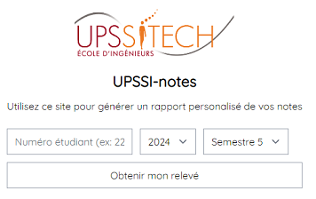

# UPSSI-notes

UPSSI-notes is a web project for school. This app is able to get with a student ID to create a wonderful summary of the different semesters of the year you have chosen.

Authors : Guillaume Roussin - Julian Trani

README last updated : 18/06/2022

## Presentation

With your student ID, you can generate a statement according to the selected semester.



## Usage

- Backend

Don't mention yet

- Frontend
   
You need to move into the package frontend, and execute the following commands :

(The first time you want to execute the frontend to generate the all the )
```bash
npm i 
```

```bash
npm run dev
```

